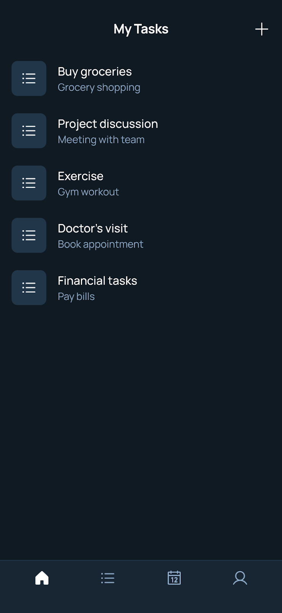
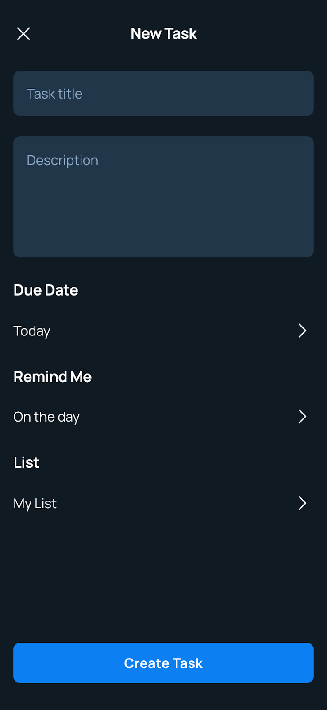

<!-- Google tag (gtag.js) -->
<script async src="https://www.googletagmanager.com/gtag/js?id=G-VBLMMR8RK0"></script>
<script>
  window.dataLayer = window.dataLayer || [];
  function gtag(){dataLayer.push(arguments);}
  gtag('js', new Date());

  gtag('config', 'G-VBLMMR8RK0');
</script>

<!-- _paginate: false -->


---

# [https://denny.one/DevJam-TW-2025](https://denny.one/DevJam-TW-2025)

---

# Denny Huang

- GDG Cloud Taipei Organizer
- <a href="https://sitcon.org/" target="_blank">SITCON 學生計算機年會</a> 共同發起人
- 雷亞遊戲 Rayark Inc.
- <a href="https://denny.one/" target="_blank">About me</a>

---




# Todo List
<sub>Design generate by <a href="https://stitch.withgoogle.com/" target="_blank">Stitch</a></sub>

<!-- _paginate: false -->

---

# Environment

## Account
- <a href="https://github.com/" target="_blank">GitHub</a> Account
- Google Account with Google Cloud Credit

---

# Environment

## Editor
- <a href="https://code.visualstudio.com/" target="_blank">Visual Studio Code</a>

## Extensions
- <a href="https://marketplace.visualstudio.com/items?itemName=ms-python.python" target="_blank">Python</a>
- <a href="https://marketplace.visualstudio.com/items?itemName=GitHub.copilot" target="_blank">GitHub Copilot</a>
- <a href="https://marketplace.visualstudio.com/items?itemName=GitHub.copilot-chat" target="_blank">GitHub Copilot Chat</a>

---

# Environment

## <a href="https://www.python.org/" target="_blank">Python</a>

## Package and project manager
- <a href="https://docs.astral.sh/uv/" target="_blank">uv</a>

## Web framework
- <a href="https://fastapi.tiangolo.com/" target="_blank">FastAPI</a>

---

# Initialization

```bash
uv init
```

# Install FastAPI
```bash
uv add "fastapi[standard]"
```

---

# Create a virtual environment

```bash
uv venv
```

# Activate the virtual environment
```bash
. .venv/bin/activate
```

---

# <a href="https://github.com/features/copilot" target="_blank">GitHub Copilot</a>


## <a href="https://github.com/settings/copilot/features" target="_blank">GitHub Copilot Settings</a>
- Privacy -> Suggestions matching public code (duplication detection filter)
- <a href="https://docs.github.com/en/copilot/managing-copilot/managing-copilot-as-an-individual-subscriber/managing-your-copilot-plan/managing-copilot-policies-as-an-individual-subscriber#enabling-or-disabling-suggestions-matching-public-code" target="_blank">Enable or disable suggestions matching public code</a>

---

# Get Gemini API Key
<a href="https://aistudio.google.com/" target="_blank">Google AI Studio</a>

---

```
幫我寫一個 FastAPI 的 todo list backend app，需要可以對待辦事項進行 CRUD 的操作，並且將待辦事項存入到一個 .json 檔案為資料庫，註解要用英文寫清楚讓 FastAPI 能夠產生文件
```

---

# Run the server in development mode
```bash
uv run fastapi dev
```

# Run the server in production mode
```bash
uv run fastapi run
```

---

# Deploy to <a href="https://cloud.google.com/run/docs/overview/what-is-cloud-run" target="_blank">Google Cloud Run</a>

<a href="https://cloud.google.com/run/docs/quickstarts/deploy-continuously" target="_blank">Deploy to Cloud Run from a git repository</a>

---

# CI / CD

---

# Create requirements.txt
```bash
uv export --format requirements.txt > requirements.txt
```

---

# Create a Cloud Run service
- Connect to repo
- Set up with Cloud Build
- Manage connected repositories
- Branch name
- Build Type

## Entrypoint
``` bash
fastapi run --port $PORT
```

---

# Clean up

## Cloud Run
- Services

## Cloud Build
- Triggers

---

# Thanks for listening

<br />
<br />

###### 本投影片採用
 <a href="https://creativecommons.org/licenses/by-sa/4.0/deed.zh-hant" target="_blank">創用 CC「姓名標示-相同方式分享 4.0 國際」授權條款</a>釋出
 <a href="https://marp.app/" target="_blank">Marp</a> 製作
